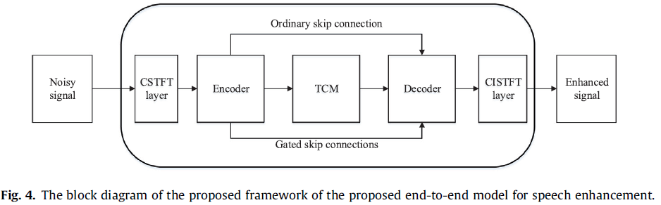
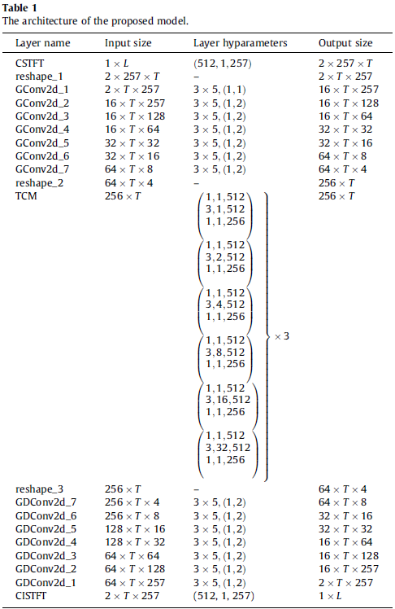

# FLGCCRN
[Zhu Y, Xu X, Ye Z. FLGCNN: A novel fully convolutional neural network for end-to-end monaural speech enhancement with utterance-based objective functions[J]. Applied Acoustics, 2020, 170: 107511.](https://www.sciencedirect.com/science/article/abs/pii/S0003682X20306150)

开源模型代码（非官方复现）

## 网络框架图

## 每一层的输入输出

